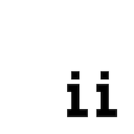

# Penciil

## About

**Penciil** is a straightforward sketchpad that generates ASCII art animations from your drawings.

It is delivered as a PWA so it can be used online or installed from [penciil.domi.land](https://penciil.domi.land/).

## Usage

To draw or erase on the canvas use the mouse (on a computer) or your finger (on a mobile device). When you are done press the play button to generate the animation.

## Development

The app is built using [TypeScript](https://www.typescriptlang.org/) with [SvelteKit](https://kit.svelte.dev/) and borrows icons from [Feather](https://feathericons.com/).

The following `npm` scripts are available for development:

- `dev`: runs the app for development, reloading on file changes
- `build`: builds the app as a static site and outputs it in the `build` directory
- `preview`: serves the `build` directory for localhost requests
- `preview:https`: serves the `build` directory for localhost requests using https
- `lint`: provides diagnostics checks for unused css, a11y hints and js/ts compiler errors
- `format`: formats the source code
